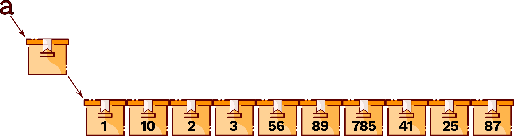

*Construction de* listes
========================

1.  Déclaration d’une liste (rappel)
    --------------------------------

Sous Python, on peut costruire une liste comme une collection d’éléments
séparés par des virgules, l’ensemble étant enfermé dans des crochets.
Exemple :

{width="8.652cm"
height="2.297cm"}

*&gt;&gt;&gt;a=\[1,10,2,3,56,89,785,41,25,87\]*

*&gt;&gt;&gt;a*

*\[1,10,2,3,56,89,785,41,25,87\]*

La première instruction crée une variable a dont le contenu *fait
référence* à une liste de 10 entiers.

1.  Construction de grandes listes
    ------------------------------

Si on doit construire une liste vraiment grande, il devient difficIle de
le faire en énumérant tous ses éléments. Différentes manières
d’initailaiser la liste peuvent alors être utilisées.

### Construction d’une liste avec une valeure unique.

On peut utiliser l’opérateur \* pour indiquer la longueur de la liste :

*&gt;&gt;&gt;a=\[0\]\*1000*

*&gt;&gt;&gt;len(a)*

*1000*

*&gt;&gt;&gt; a\[0\]*

*0*

*&gt;&gt;&gt; a\[-1\]*

*0*

### Listes par compréhension

La liste en compréhension permet d'écrire des boucles for plus concises.
Très utiles dès lors que l’on souhaite créer une nouvelle liste basée
sur une pré-existante. Par exemple, on peut utiliser une liste en
compréhension pour créer une liste contenant les carrés des 1000
premiers entiers. Classiquement ce programme peut s’écrire :

Cette nouvelle construction mélange les crochets, qui explicitent la
construction d’une liste, et les mots-clés de la boucle for de Python,
qui explicite le remplissage de la liste avec une boucle. Cette
structure s’appelle une ***liste par compréhension.***

Dans cette construction, le parcours de la variable i n’est pas limitée
à un intervalle d’entiers construits avec range. On peut parcourir une
autre liste :

*&gt;&gt;&gt; t = \[3\*i+1 for i in range(10)\]*

*&gt;&gt;&gt; a = \[x \*x for x in t\]*

*&gt;&gt;&gt; t*

*\[1, 4, 7, 10, 13, 16, 19, 22, 25, 28\]*

*&gt;&gt;&gt; a*

*\[1, 16, 49, 100, 169, 256, 361, 484, 625, 784\]*

**

Il est possible de ne conserver que certaines valeurs prises par la
variable, en ajoutant une condition booléenne à la compréhension, avec
le mot-clé if

*&gt;&gt;&gt; a = \[i \* i for i in range(30) if i % 4 == 1\]*

*&gt;&gt;&gt; a*

*\[1, 25, 81, 169, 289, 441, 625, 841\]*

**
