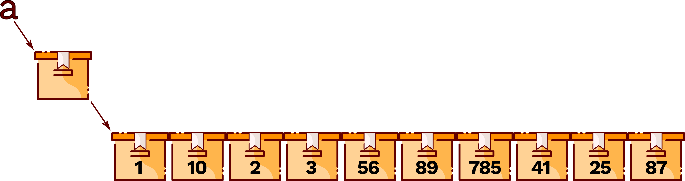

Les listes
==========

Dans de nombreuses situations, on a besoin d’utiliser des valeurs qui,
comme les textes, les images ou les sons, sont formées de plusieurs
nombres ou de plusieurs booléens. Ces valeurs sont dites des ***données
composites.*** Sous python le nom de liste est utilisé.

1.  Déclaration d’une liste
    -----------------------

Sous Python, on peut définir une liste comme une collection d’éléments
séparés par des virgules, l’ensemble étant enfermé dans des crochets.
Exemple :

{width="10.075cm"
height="2.674cm"}

*&gt;&gt;&gt;a=\[1,10,2,3,56,89,785,41,25,87\]*

*&gt;&gt;&gt;a*

*\[1,10,2,3,56,89,785,41,25,87\]*

La première instruction crée une variable a dont le contenu *fait
référence* à une liste de 10 entiers.

1.  Accès aux données d’une liste
    -----------------------------

Un des gros avantages d’une liste est que l’on peut appeler ses éléments
par leur position. Ce numéro est appelé indice (ou index) de la liste.

On accède à une case d’une liste avec l’expression NomVariable\[index\].
nomVariable correspond au nom de la boîte, dont le contenu est la
référence à la liste à n cases et index est une expression dont la
valeur est un nombre entier compris entre 0 et n – 1.

### Index d’une liste

La numérotation des indexs d’une liste de n éléments commence à partir
de zéro et se termine à n-1. Mais la liste peut également être indexée
avec des nombres négatifs. Les indices négatifs reviennent à compter à
partir de la fin. Leur principal avantage estest de pouvoir accéder au
dernier élément d’une liste à l’aide de l’indice -1 sans pour autant
connaître la longueur de cette liste. L’avant dernier élément a lui
l’indice -2, l’avant-avant dernier l’indice -3, etc.

*&gt;&gt;&gt;a=\[1,10,2,3,56,89,785,41,25,87\]*

*&gt;&gt;&gt;a\[0\]*

{width="12.247cm"
height="3.679cm"}*1*

*&gt;&gt;&gt;a\[6\]*

*785*

*&gt;&gt;&gt;a\[-1\]*

*87*

### 

### 

### Les tranches (slicing)

Un autre avantage des listes est la possibilité de sélectionner une
partie d’une liste en utilisant un indiçage construit sur le modèle
\[m:n+1\] pour récupérer tous les éléments, du émième au énième (de
l’élément m inclus à l’élément n+1 exclu). On dit alors qu’on récupère
une tranche de la liste, par exemple :

*&gt;&gt;&gt;a=\[1,10,2,3,56,89,785,41,25,87\]*

*&gt;&gt;&gt;a\[2:4\]*

*\[2,3\]*

*&gt;&gt;&gt;a\[:3\]*

*\[1,10,2\]*

*&gt;&gt;&gt;a\[:-4\]*

*\[1,10,2,3,56,89\]*

1.  Opération sur les listes
    ------------------------

<!-- -->

1.  Le balayage d’une liste
    -----------------------

Le balyage d’une liste consiste à lire successivement l’ensemble des
valeurs contenues dans une liste afin d’éventuellement opérer un
traitement. Cette opération peut être réalisé avec une boucle for ayant
la liste à balayer comme argument. Dans l’exemple suivant, la variable i
prendra successivement les valeurs contenues dans le tableau. La boucle
for sera donc exécutées 4 fois puisque la liste a contient 4 éléments.

**
