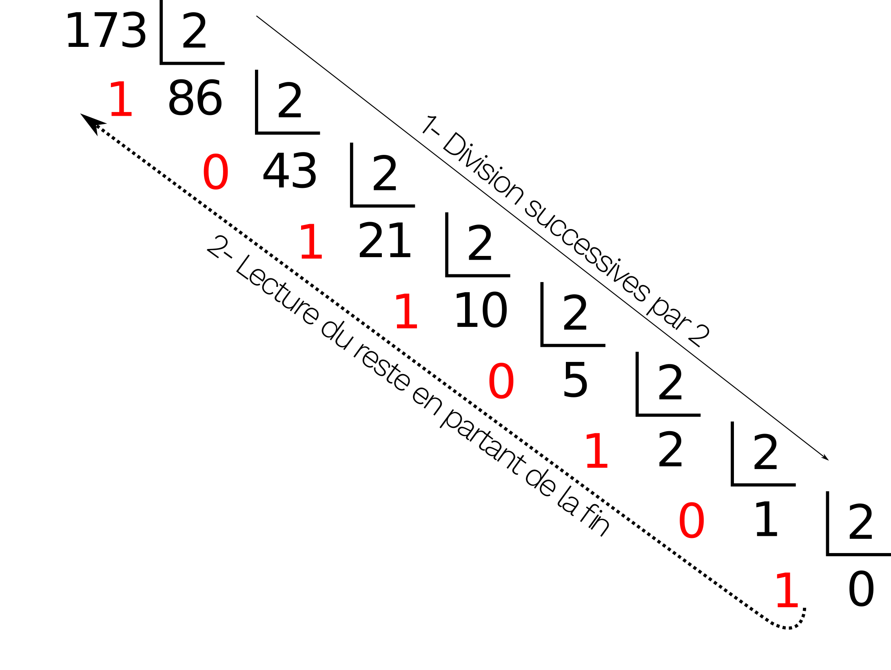
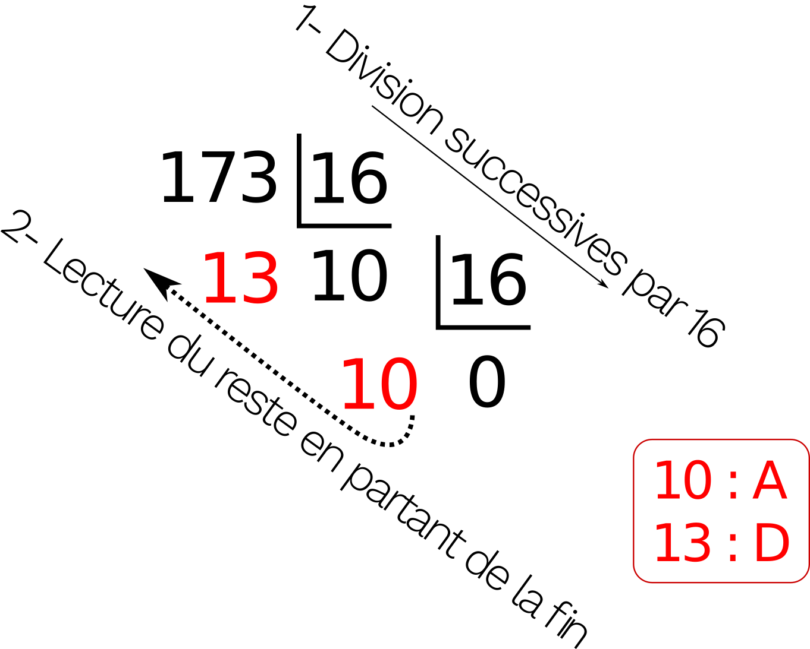

# Représentation des nombres entiers positifs
[Format PDF](https://drive.google.com/file/d/148UUVjOCSvb5P0b3ndK-WUXMxHaTcpvX/view?usp=sharing)  

Les représentations écrites d’un nombre sont multiples ; elles varient selon les cultures. On distingue principalement deux types d’écritures :

- Ecriture à base de symboles
Le principe repose sur l’addition (et parfois soustraction) de symboles représentant des nombres. Par exemple :
    • La numération mésopotamienne, 3000 ans av J.C.
    • La numération romaine →  MMXIX = 2019

- Ecriture à base de rang (ou de position).
Ce principe d’écriture est utilisé actuellement tous les jours  2019 = 2 x 1000 + 0 x 100 + 1 x 10 + 9 x 1.

Ou encore : 2019 est égal à 2 milliers, 0 centaines, 1 dizaine, 9 unités.

Actuellement dans la vie quotidienne, la base 10 (décimale) est utilisée (nous avons 10 doigts) alors que dans les ordinateurs représentent les nombres selon la base 2 (les composants de bases utilisés peuvent prendre deux états).

Les nombres en base 2 sont représentés avec beaucoup de caractères (32 caractères et plus) ce qui rend fastidieux leur écriture. En conséquence lors de l’étude de systèmes informatiques, l’utilisation de la base 16 (hexadécimal) est privilégiée pour simplifier l’écriture.

## Concept d’une représentation numérique par base

Les nombres que nous utilisons sont composés de chiffres c pondérés dans une base b. Dans une base b, il existe b-1 chiffres représentés par des symboles distincts. On peut donc généraliser la forme d’écriture d’un nombre ainsi :

#### La base décimales (base 10)

Ce système de numération, utilise dans la vie quotidienne, dispose de 10 symboles différents : **0, 1, 2, 3, 4, 5, 6, 7, 8 et 9**.

On parle de base 10. Un nombre entier positif N s’écrit en base 10 :

$$ N_{10} = N = c_{n−1} \times 10^{n−1} + c_{n−2} \times 10^{n−2} + ... + c_{1} \times 10^{1} + c_{0} \times 10^{0} $$

Pour spécifier la base utilisée, on place généralement le nombre entier positif suivi de la base utilisée en indice.

Exemple :

$$ 7 239_{10} = 7 239 = 7  \times 10^3 + 2 \times 10^2 + 3 \times 10^1 + 9 \ times 10^0 $$

Pour la base 10, on oublie souvent de spécifier la base car il s'agit de la base de numération utilisée quotidiennement. Les digits correspondent aux coefficients cn. Ils ne peuvent prendre que des valeurs appartenant à la base.

Les poids sont les puissances de 10. Le poids est égal à la base élevée à la puissance de son rang.

#### Numération binaire (base 2)

La numération binaire ou en base 2 utilise deux symboles : **0 et 1**.

Cette base est très commode pour distinguer les deux états logiques fondamentaux (Lampe allumée ou éteinte, présence ou non dans une pièce, couleur noir ou blanc...), et est très utilisée en informatique.

On écrit :

$$ N = c_{n−1} \times 2^{n−1} + c_{n−2} \times 2^{n−2} + ... + c_{1} \times 2^{1} + c_{0} \times 2^{0} $$

Exemple :
Que représente la valeur 10000101₂ ?

$10000101_2 = 1 \times 2^7 + 0 \times 2^6 + 0 \times 2^5 + 0 \times 2^4 + 0\times 2^3 + 1 \times 2^2 + 0 \times 2^1 + 1 \times 2^0$ ce qui vaut 133

- En numération binaire, les digits ($c_i$) sont appelés **bit** (abreviation de Binary digIT).
- Un code binaire à n bits distingue $2^n$ états ou combinaisons et la valeur la plus grande représentable vaut $2^{n-1}$
- Le bit de poids le plus fort ($c_{n-1}$) est appelé **MSB** (Most Significant Bit).
- Le bit de poids le plus faible ($c_0$) est appelé **LSB** (Low Significant Bit).
- Un regroupement successif de 4 bits s'appelle un **quartet**.
- Un regroupement successif de 8 bits s'appelle un **octet**.
- Un regroupement successif de k bits (k > 8) s'appelle un mot de k bits.

## Numération hexadécimale (base 16)

Ce système de numération est très utilisé dans l’analyse du fonctionnement de systèmes ordinateurs et micro-ordinateurs ainsi que dans le domaine des transmissions de données. Cette base correspond à une contraction d’écriture de la base 2.

Il comporte 16 symboles : **0, 1, 2, 3, 4, 5, 6, 7, 8, 9, A, B, C, D, E, F**.

Pour indiquer la base 16, on peut utiliser le caractère $ (dollar) devant le nombre, ou alors 16# devant le nombre.
Exemple :  $A8_{16}$ = 16#A8 = $A8

On écrit :

$$ N = c_{n−1} \times 16^{n−1} + c_{n−2} \times 16^{n−2} + ... + c_{1} \times 16^{1} + c_{0} \times 16^{0} $$

Exemple : Que représente la valeur $A8 ?

$A8_{16} =10 \times 16^1 + 8 \times 16^0$
    ce qui vaut 168

## Les changements de base

#### Conversions directes

Du binaire vers l'hexadécimal_ : Pour convertir du binaire vers l'hexadécimal, on divise le nombre binaire en quartet, en partant de la droite. Chacun des paquets est ensuite converti en hexadécimal.

Exemple : 110101110001₂  = 1101 0111 0001₂ = 16#D71

_De l'hexadécimal vers le binaire_ : C'est le processus directement inverse, on écrit chaque quartet sur 4 bits en binaire en complétant éventuellement avec des zéros sur la gauche.

Exemple : 1C3516 = 0001 1100 0011 0101₂

#### Conversions indirectes

Un nombre entier positif N étant donné en base 10, on cherche à l'écrire dans une autre base notée b. La méthode consiste à diviser le nombre décimal N par b et à conserver le reste (division entière). Le quotient obtenu est ainsi successivement divisé tant qu'il n'est pas nul. Les restes successifs sont écrits, en commençant par le dernier, de la gauche vers la droite, pour former l'expression de N dans le système de base b.

_Du décimal vers le binaire_

Exemple pour la conversion de 173 en base 2, il faut effectuer des divisions successives par 2

<figure markdown>
{width="300"}
<figcaption>Divisions successives par 2</figcaption>
</figure>

le résultat est donc 17310 → 10101101₂

_Du décimal vers l'hexadécimal_ :
On reprend la même méthode mais en divisant par 16 :

<figure markdown>
{width="200"}
<figcaption>Divisions successives par 16</figcaption>
</figure>

le résultat est donc 17310 →  $AD.

Remarque : La division euclidienne étant source d’erreur de calcul, il est conseillé d’effectuer la conversion en base 2 du nombre en base 10 puis de convertir le nombre binaire en base 16.